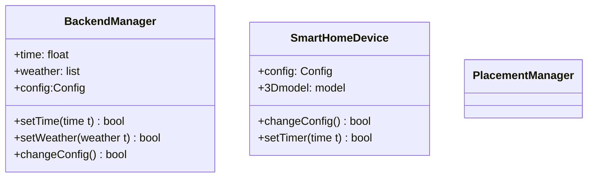

```mermaid
classDiagram

class BackendManager{
    +time: float
    +weather: list
    +config:Config 
    +setTime(time t) bool
    +setWeather(weather t) bool
    +changeConfig() bool
}

class SmartHomeDevice{
    +config: Config
    +3Dmodel: model
    +changeConfig() bool
    +setTimer(time t) bool
}

class PlacementManager{

}


```